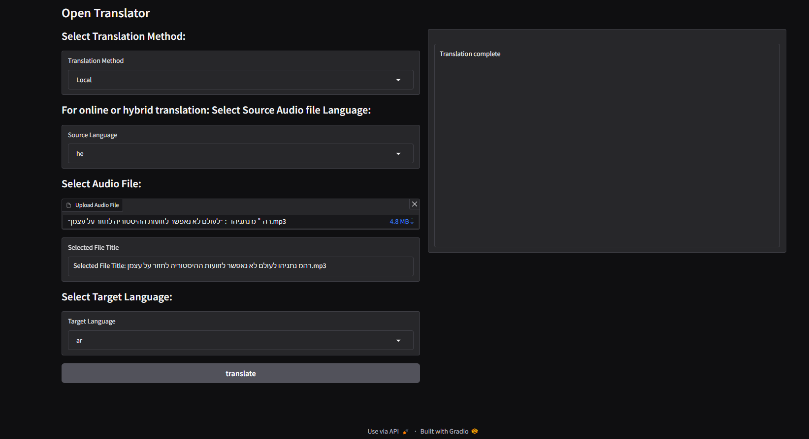

# Open Translator: Speech To Speech and Speech to text Translator with voice cloning and other cool features
## Can be run as Online mode ( connected to internet and make api calls using Google translate - No api keys are needed ) 
## Or Fully Locally  (using local LLM's)
## Or as a Hybrid mode (mix of Online and one single Local LLM )

## Features

- Translate from and to 17 Languages :

   - The translator supports various languages, including English, Spanish, French, German, Dutch , Japanese, Korean, Turkish, Arabic, Russian, Hebrew, Hindi, Italian, Portuguese, Chinese, Czech and Hungarian.

## Options

- File Menu available options:

- Convert Audio file to MP3
- Extract audio from Video
- YouTube Downloader
- Replace Audio in Video
- Video Text Adder
- Voice Recorder
- PyTranscriber (shortcut)
- Exit

## Requirements

Make sure you have the following dependencies installed:

- Python >= 3.10
- Pip (Python package installer)
- [FFmpeg](https://ffmpeg.org/download.html) #Should be installed manually and added to sys env path

## Usage

1- Clone the repository:

```
git clone https://github.com/overcrash66/OpenTranslator.git
```

2- Navigate to folder:

```
cd OpenTranslator
```

3- Create a vitrual env:

```
py -3.10 -m venv venv
```

```
venv\Scripts\activate
```

4- Install the required Python packages using:

If you would like to use CUDA 118 - GPU:

PY -3.10
```bash
pip install torch==2.1.2+cu118 torchaudio==2.1.2+cu118 --index-url https://download.pytorch.org/whl/cu118
```

PY -3.12
```bash
pip install torch==2.2.1+cu118 torchaudio==2.2.1+cu118 --index-url https://download.pytorch.org/whl/cu118
```

Install mecab 
https://github.com/ikegami-yukino/mecab/releases


```bash
pip install -r requirements_Py312.txt
```

OR by default you use CPU only:

```bash
pip install -r requirements.txt
```

5- Run the Script:

```bash
python OpenTranslator.py
```

Or Local mode (using a set of LLM's) for audio file translation only, using a WEB UI (Gradio)

```
python WebUI.py

```

## GUI Preview




## Audio translation examples:

- Arabic Test:
  <audio controls>
    <source src="https://jmp.sh/s/EzCnFUdaucwBtF3qrIdb" type="audio/mpeg">
    Your browser does not support the audio element.
  </audio>

- Chinese Test:
  <audio controls>
    <source src="./testResults/cn-test.mp3" type="audio/mpeg">
    Your browser does not support the audio element.
  </audio>

- Czech Test:
  <audio controls>
    <source src="./testResults/cs-test.mp3" type="audio/mpeg">
    Your browser does not support the audio element.
  </audio>

- German Test:
  <audio controls>
    <source src="./testResults/de-test.mp3" type="audio/mpeg">
    Your browser does not support the audio element.
  </audio>

- English Test:
  <audio controls>
    <source src="./testResults/en-test.mp3" type="audio/mpeg">
    Your browser does not support the audio element.
  </audio>

- Spanish Original Audio that was used to translate to all the other languages:
  <audio controls>
    <source src="./testResults/es-Original-Audio.mp3" type="audio/mpeg">
    Your browser does not support the audio element.
  </audio>

- French Test:
  <audio controls>
    <source src="./testResults/fr-test.mp3" type="audio/mpeg">
    Your browser does not support the audio element.
  </audio>

- Hindi Test:
  <audio controls>
    <source src="./testResults/hi-test.mp3" type="audio/mpeg">
    Your browser does not support the audio element.
  </audio>

- Hungarian Test:
  <audio controls>
    <source src="./testResults/hu-test.mp3" type="audio/mpeg">
    Your browser does not support the audio element.
  </audio>

- Italian Test:
  <audio controls>
    <source src="./testResults/it-test.mp3" type="audio/mpeg">
    Your browser does not support the audio element.
  </audio>

- Japanese Test:
  <audio controls>
    <source src="./testResults/jp-test.mp3" type="audio/mpeg">
    Your browser does not support the audio element.
  </audio>

- Korean Test:
  <audio controls>
    <source src="./testResults/ko-test.mp3" type="audio/mpeg">
    Your browser does not support the audio element.
  </audio>

- Dutch Test:
  <audio controls>
    <source src="./testResults/nl-test.mp3" type="audio/mpeg">
    Your browser does not support the audio element.
  </audio>

- Polish Test:
  <audio controls>
    <source src="./testResults/pl-test.mp3" type="audio/mpeg">
    Your browser does not support the audio element.
  </audio>

- Portuguese Test:
  <audio controls>
    <source src="./testResults/pt-test.mp3" type="audio/mpeg">
    Your browser does not support the audio element.
  </audio>

- Russian Test:
  <audio controls>
    <source src="./testResults/ru-test.mp3" type="audio/mpeg">
    Your browser does not support the audio element.
  </audio>

- Turkish Test:
  <audio controls>
    <source src="./testResults/tr-test.mp3" type="audio/mpeg">
    Your browser does not support the audio element.
  </audio>


## Configuration

- You can customize the translation models and other settings by modifying the script.

## License

This project is licensed under the GPL License - see the [LICENSE](LICENSE) file for details.

## Acknowledgements

Special thanks to:
[XTTS_V2](https://huggingface.co/coqui/XTTS-v2)
[whisper v3 Large](https://huggingface.co/openai/whisper-large-v3)
[Llama2-13b-Language-translate](https://huggingface.co/SnypzZz/Llama2-13b-Language-translate)
[autosub](https://github.com/agermanidis/autosub)
[gTTS](https://github.com/pndurette/gTTS)
